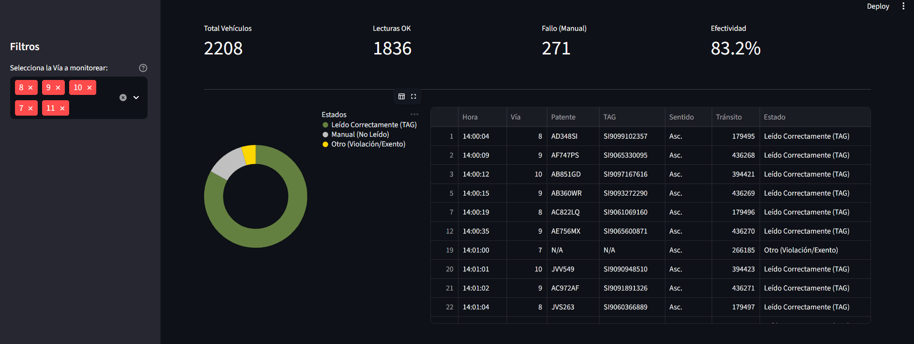

# 📡 Visualizador de Rendimiento de Antena Telepase


Este proyecto es una herramienta de análisis de datos desarrollada en Python para monitorear y visualizar el rendimiento de las antenas de lectura de Telepase en estaciones de peaje.

La aplicación procesa reportes de eventos (archivos `.xls` o `.csv`), identifica vehículos únicos mediante el número de tránsito y calcula la efectividad de lectura automática frente a las intervenciones manuales.

## 🚀 Funcionalidades

* **Detección Inteligente de Vehículos:** Agrupa eventos por número de tránsito único para evitar duplicados.
* **Lógica de Negocio:**
    * Detecta lecturas exitosas ("TAG Pospago...").
    * Identifica fallos de lectura que requirieron intervención manual ("Patente Ingresada Manualmente").
    * Clasifica violaciones y vehículos exentos.
* **Compatibilidad Universal:** Soporta archivos antiguos de Excel (`.xls` binarios) y CSVs modernos, detectando automáticamente la codificación (UTF-8, Latin-1).
* **Visualización Interactiva:** Gráficos de torta y tablas filtrables generados con **Streamlit** y **Altair**.
* **Modo Portable:** Diseñado para ejecutarse desde una memoria USB sin instalación previa en el equipo host.

## 🛠️ Tecnologías Utilizadas

* **Python 3.11**
* **Pandas:** Manipulación y limpieza de datos.
* **Streamlit:** Interfaz de usuario web.
* **Altair:** Visualización de datos.
* **OpenPyXL / XLRD:** Soporte para archivos Excel.

## 📋 Requisitos de Instalación (Para Desarrolladores)

Si deseas ejecutar el código fuente en tu entorno de desarrollo:

1.  Clona el repositorio:
    ```bash
    git clone [https://github.com/ezebellino/visualizador-telepase.git](https://github.com/ezebellino/visualizador-telepase.git)
    cd visualizador-telepase
    ```

2.  Instala las dependencias:
    ```bash
    pip install streamlit pandas altair openpyxl xlrd
    ```

3.  Ejecuta la aplicación:
    ```bash
    streamlit run app.py
    ```

## 💾 Modo Portable (Para Usuarios Finales)

Esta aplicación está diseñada para ser distribuida en una carpeta portable ("Portable App") que incluye un intérprete de Python embebido.

**Pasos para ejecutar:**
1.  Conecta el pendrive o descarga la carpeta del proyecto.
2.  Haz doble clic en el archivo **`INICIAR.bat`**.
3.  Se abrirá automáticamente el navegador con el visualizador.
4.  Arrastra tu archivo `.xls` o `.csv` al área de carga.

## 🔍 Lógica de Clasificación

El algoritmo sigue estas reglas de prioridad basándose en la secuencia de eventos del reporte:

1.  **Manual (Fallo):** Si antes de cerrar el tránsito aparece el evento "Tránsito con Patente Ingresada Manualmente", se considera que la antena falló, independientemente de si luego el sistema asignó una categoría de TAG.
2.  **Leído (Éxito):** Si el vehículo tiene eventos de "TAG" y no requirió ingreso manual.
3.  **Otro:** Violaciones, exentos sin Tag o vehículos sin categorizar.

---
**Desarrollado por [Zeqe Bellino](https://zeqebellino.com)**