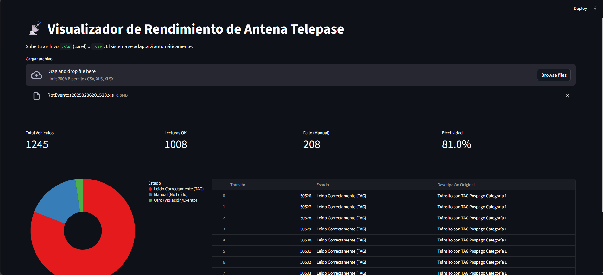

# 📡 Sistema de Monitoreo y Análisis de Antenas Telepase (v1.1)



Este proyecto es una herramienta de análisis de datos desarrollada en Python para monitorear y visualizar el rendimiento de las antenas de lectura de Telepase en estaciones de peaje. 

La aplicación procesa reportes de eventos, identifica vehículos únicos y calcula la efectividad de lectura automática, permitiendo ahora un filtrado granular por vías y extracción avanzada de datos.

## ✨ Novedades en la última versión
* **Extracción Inteligente (Regex):** El sistema ahora lee las observaciones y extrae automáticamente la **Patente** y el **Número de Dispositivo TAG** de cada vehículo.
* **Filtros Dinámicos:** Nuevo panel lateral para filtrar la información por **Vías** específicas (ej: Vías Ascendentes vs. Descendentes).
* **Mejoras de UI/UX:** Gráficos actualizados con colores semánticos (Verde = Éxito, Rojo = Fallo, Amarillo = Violación/Exento) para una lectura visual más rápida y tablas responsivas.
* **Datos Temporales Precisos:** Detección y conversión nativa de los horarios de eventos directamente desde los metadatos del archivo.

## 🚀 Funcionalidades Principales

* **Detección de Vehículos:** Agrupa eventos por número de tránsito único para evitar duplicados en el conteo.
* **Lógica de Clasificación:**
    * **Leído Correctamente:** Vehículos con eventos de "TAG" sin intervención manual.
    * **Fallo (Manual):** Identifica intervenciones manuales ("Patente Ingresada Manualmente") previas al cierre del tránsito.
    * **Otros:** Clasificación de violaciones de vía y vehículos exentos.
* **Compatibilidad Universal:** Soporta archivos antiguos de Excel (`.xls` binarios) y CSVs modernos, detectando automáticamente la codificación.
* **Modo Portable:** Diseñado para ejecutarse desde una memoria USB sin instalación previa en el equipo host.

## 🛠️ Tecnologías Utilizadas
* **Python 3.11** (Lógica central y Expresiones Regulares `re`)
* **Pandas** (Limpieza y manipulación de DataFrames)
* **Streamlit** (Interfaz de usuario web)
* **Altair** (Visualización de datos semántica)
* **OpenPyXL / XLRD** (Soporte multiplataforma para Excel)

## 📋 Requisitos de Instalación (Para Desarrolladores)

Si deseas ejecutar el código fuente en tu entorno de desarrollo:

1.  Clona el repositorio:
    ```bash
    git clone [https://github.com/ezebellino/visualizador-telepase.git](https://github.com/ezebellino/visualizador-telepase.git)
    cd visualizador-telepase
    ```

2.  Instala las dependencias:
    ```bash
    pip install streamlit pandas altair openpyxl xlrd
    ```

3.  Ejecuta la aplicación:
    ```bash
    streamlit run app.py
    ```

## 🐳 Modo Docker

1. Build:
    ```bash
    docker build -t visualizador-telepase .
    ```
2. Run:
    ```bash
    docker run -p 8501:8501 visualizador-telepase
    ```
3. Abrir en: http://localhost:8501

## ✅ CI (GitHub Actions)

Se agregó `/.github/workflows/python-app.yml`:
- tests con `pytest`
- lint con `ruff` y `black`

## 💾 Modo Portable (Para Usuarios Finales)

Esta aplicación está diseñada para ser distribuida en una carpeta portable ("Portable App") que incluye un intérprete de Python embebido.

**Pasos para ejecutar:**
1.  Conecta el pendrive o descarga la carpeta del proyecto.
2.  Haz doble clic en el archivo **`INICIAR.bat`**.
3.  Se abrirá automáticamente el navegador con el visualizador.
4.  Arrastra tu archivo `.xls` o `.csv` al área de carga.

## 🔍 Lógica de Clasificación

El algoritmo sigue estas reglas de prioridad basándose en la secuencia de eventos del reporte:

1.  **Manual (Fallo):** Si antes de cerrar el tránsito aparece el evento "Tránsito con Patente Ingresada Manualmente", se considera que la antena falló, independientemente de si luego el sistema asignó una categoría de TAG.
2.  **Leído (Éxito):** Si el vehículo tiene eventos de "TAG" y no requirió ingreso manual.
3.  **Otro:** Violaciones, exentos sin Tag o vehículos sin categorizar.

---
**Desarrollado por [Zeqe Bellino](https://zeqebellino.com)**